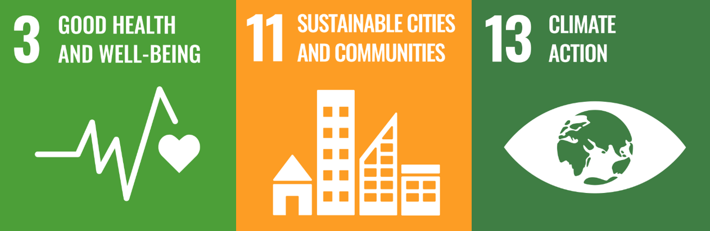
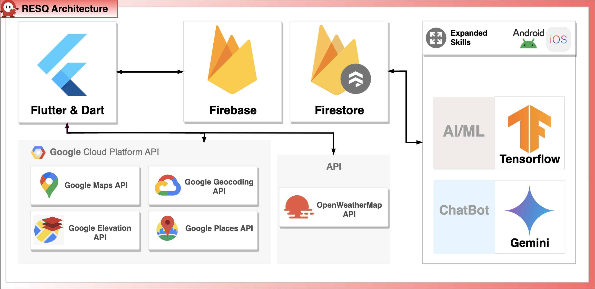

## 😀 Welcome to RESQ :)
  * Provides accident type alerts to users by analyzing real-time location-based risk information.
  * Instills a sense of danger in users, providing accident prevention and response measures.
  * **An accident prevention service through place recognition and crisis detection.**
  
## 📢 Introduction
  Unexpected accidents and emergencies can occur at any time depending on the characteristics of each country or region. This includes earthquakes, fires, traffic accidents, etc. When an urgent situation occurs, it is difficult to make quick and accurate judgments. Therefore, we wanted to allow users to be aware of countermeasures in advance by having a sense of caution before a crisis situation.
  RESQ helps users to prevent and prepare wherever they are. It collects and analyzes user data in real time to inform you of all possible dangerous situations. Then, it presents preventive measures that users can prepare for. 

## ⚽️ UN SDGs & Our Goals

  Our solution has selected **Health and Well-being, Sustainable Cities and Communities, and Climate Action from the UN's Sustainable Development Goals.** The reason for choosing these goals is considering the reality that many people are currently unable to cope with unexpected accidents or disasters, and as a result, casualties and property damage are occurring. We aimed to develop a system that could take immediate action to prevent and prepare for such situations.

## ⚙ Google Technologies Used
  * **Flutter** 
  * **Firebase**
  * **Google Cloud API Service**
  
## 🛠️ PROJECT Architecture


## 📱 APP Screenshot & Description
<table>
  <tr>
    <td valign="top"></td>
    <td valign="top">
      <h4><ul>
        <li>The app activates a map based on the user's current location.</li><br><br>
        <li>It provides various information suitable for the user's current location.</li><br><br>
        <li>Considering the user's location and surrounding areas, it displays the current weather, place information, and major types of accidents.</li><br><br>
        <li>Out of a total of 27 types of accident data, it analyzes accident types associated with the user's current location.</li><br><br>
        <li>It provides the user with the three most likely types of accidents to occur in their current location.</li><br><br>
        <li>When clicking on the accident type list, it provides a detailed explanation video about that type of accident, along with detailed measures and preparations for it.</li><br><br>
        <li>On the bottom right of the app screen, there is a phone icon that you can click to call 119 immediately, enabling a quick response in an emergency.</li>
      </ul><h4>
    </td>
  </tr>
</table>


## ⭐️ Future
  Our goal is to get as many people as possible to use the RESQ application, enabling them to live in a safe environment. To this end, we plan to pursue the following expansion plans in the next step:
  * **Hardware integration**: We will distribute accident prevention videos and images on billboards or signs and attach QR codes for easy access to the RESQ application. This will reduce the inconvenience of users having to find and install the application themselves and increase the accessibility of the application.
  * **AI feature expansion**: Currently, we have the ability to detect disaster situations such as fires and earthquakes, but we plan to expand this to detect and respond to various accident situations. We will improve the AI algorithm and collect new data for learning if needed to analyze and provide more information.
  * **UI improvement**: We will improve the UI so that users can use the RESQ application more conveniently. To this end, we will collect user feedback, conduct A/B tests, and improve the UI/UX.

## 🏃 How to Run
  * To build, an API key is required.
    * Modify the following part in the code located in the /android/app/src/main/AndroidManifest.xml directory.
    ```
    <meta-data 
	android:name = "com.google.android.geo.API KEY"
	android:value = "API KEY"/> <!-- Please insert the Google Map API key here --> 
    ```
    
    * Add the API key to the "GEOCODE_API" variable in the /lib/widgets/location_display.dart file.
    ```
    const GEOCODE_API = "API KEY"; // Please insert the Google Geocode API key here
    ```
    * Add the API key to the API variable in the /lib/widgets/location_based_information.dart file.
    ```
    const googleElevationKey = "API KEY" //Please insert the Google Elevation API key here
    const googlePlacesKey = "API KEY" //Please insert the Google Places API key here
    const weatherKey = "API KEY"; //Please insert the OpenWeatherMap API key here
    ```
  * **The runApp code only exists in the /lib/main.dart file. Therefore, the app is built from the main.dart file.**
  * After the app is launched, it analyzes and outputs the type of accident based on the acquired location and weather data.
    * There may be a slight delay in providing this information.
  * Currently, **it only supports Android devices,** but plans to make ios devices available in the future. 

## 🚨 RESQ R&R
- **김민혁** (MinHyeok Kim)
- **정애리** (AeRi Jung)
- **곽지훈** (JiHoon Kwak)
- **표성우** (SungWoo Pyo)
    

## 💰 Credits
This project uses icons from Flaticon(www.flaticon.com) by various designers:

- [Andrejs Kirma](https://www.flaticon.com/kr/authors/andrejs-kirma)
- [BankSeeNgern](https://www.flaticon.com/kr/authors/bankseengern)
- [Circlon Tech](https://www.flaticon.com/kr/authors/circlon-tech)
- [Dixit Lakhani_02](https://www.flaticon.com/kr/authors/dixit-lakhani-02)
- [Ehtisham Abid](https://www.flaticon.com/kr/authors/ehtisham-abid)
- [Freepik](https://www.flaticon.com/kr/authors/Freepik)
- [GOFOX](https://www.flaticon.com/kr/authors/GOFOX)
- [IdeaGrafc](https://www.flaticon.com/kr/authors/ideagrafc)
- [kliwir art](https://www.flaticon.com/kr/authors/kliwir-art)
- [Leremy](https://www.flaticon.com/kr/authors/leremy)
- [Mehwish](https://www.flaticon.com/kr/authors/mehwish)
- [Muhammad_Usman](https://www.flaticon.com/kr/authors/muhammad-usman)
- [NajmunNahar](https://www.flaticon.com/kr/authors/najmunnahar)
- [orvipixel](https://www.flaticon.com/kr/authors/orvipixel)
- [Prosymbols Premium](https://www.flaticon.com/kr/authors/prosymbols-premium)
- [Smashicons](https://www.flaticon.com/kr/authors/smashicons)
- [tulpahn](https://www.flaticon.com/kr/authors/tulpahn)
- [Vector Stall](https://www.flaticon.com/kr/authors/vector-stallk)
- [WR Graphic Garage](https://www.flaticon.com/kr/authors/wr-graphic-garage)
- [Yuluck](https://www.flaticon.com/kr/authors/Yuluck)
